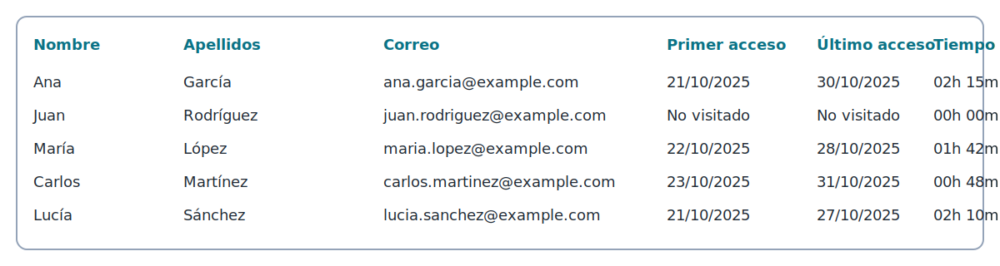

# Pruebas, datos de ejemplo y aseguramiento de calidad

Este documento explica cómo preparar datos de prueba, ejecutar la batería automatizada y validar manualmente los principales flujos. Es útil tanto para QA como para becarios que necesiten comprobar sus cambios antes de solicitar una revisión.

## 1. Requisitos previos

- Python 3.11 o superior con `pip` actualizado.
- Dependencias instaladas ejecutando `pip install -e .[dev]` desde la raíz del repositorio.
- Redis y Postgres disponibles si deseas reproducir pruebas que interactúan con RQ o la base de datos. Para la mayoría de tests se usan `sqlite:///:memory:` y `fakeredis`, por lo que no es obligatorio levantar servicios externos.

## 2. Ejecutar la suite automatizada

1. Desde la raíz del proyecto, lanza:
   ```bash
   pytest
   ```
2. La batería cubre ingesta de XLSX, APIs REST, motor de reglas, dispatcher de notificaciones, adaptadores (CLI, email, WhatsApp), sincronización con Moodle y programación de jobs.【F:tests/test_uploads.py†L1-L118】【F:tests/test_courses_api.py†L1-L136】【F:tests/test_dispatcher.py†L1-L214】
3. Si necesitas medir cobertura, ejecuta `pytest --cov=app --cov=tests` y revisa el informe HTML generado en `.htmlcov/`.

> Los fixtures compartidos se definen en `tests/conftest.py` e incluyen bases de datos temporales, colas en memoria y utilidades para construir playbooks de prueba.【F:tests/conftest.py†L1-L170】

## 2.1. Flujos recomendados

Cuando quieras validar cambios en áreas específicas sin esperar a que termine la suite completa, lanza subconjuntos orientados a los módulos responsables:

- Dispatcher de notificaciones: `pytest tests/test_dispatcher.py`. El flujo refleja las rutas principales de `app/notify/dispatcher.py`, incluyendo la orquestación de adaptadores y la coordinación con la cola RQ.【F:app/notify/dispatcher.py†L1-L200】
- Motor de reglas: `pytest tests/test_rules_engine.py`. Ayuda a validar que las evaluaciones delegadas en `app/rules/engine.py` siguen siendo deterministas frente a nuevos playbooks.【F:app/rules/engine.py†L1-L200】
- Cargador de hojas de cálculo: `pytest tests/test_uploads.py -k parse_xlsx` te permite comprobar rápidamente cambios en la ingesta de XLSX sin ejecutar escenarios completos.【F:app/modules/ingest/xlsx_importer.py†L1-L200】
- End-to-end de subidas: `pytest tests/test_uploads.py` verifica el endpoint `/uploads`, la creación del registro `UploadedFile` y la normalización de tiempos a partir del reporte Moodle actualizado.【F:tests/test_uploads.py†L1-L156】

## 3. Datos de ejemplo para pruebas manuales

El repositorio incluye todos los artefactos necesarios para reproducir el flujo de ingestión sin depender de datos reales:

- **Reporte Moodle actualizado** (`assets/moodle_report_example.xlsx`). Reproduce el formato exportado por Moodle con las columnas `Nombre`, `Apellidos`, `Correo`, `Primer acceso`, `Último acceso` y `Tiempo total`. La ingesta une nombre y apellidos, convierte la duración a horas decimales, estima las horas requeridas y la fecha límite a partir de la actividad registrada y persiste los accesos como atributos de matrícula.【F:workflows/mappings/moodle_prl.yaml†L1-L19】【F:app/modules/ingest/course_loader.py†L43-L215】【F:app/modules/ingest/course_loader.py†L397-L487】
- **Vista previa ilustrativa** (`assets/moodle_report_preview.svg`). Úsala en sesiones de onboarding para que cualquier perfil identifique el aspecto esperado del fichero antes de subirlo.
- **Playbook de ejemplo** (`workflows/playbooks/sample_prl_playbook.yaml`). Define un flujo completo con quiet hours y acciones `notify`; duplica el fichero para generar nuevas variantes.【F:workflows/playbooks/sample_prl_playbook.yaml†L1-L44】
- **Ruleset base** (`app/rules/rulesets/sample.yaml`). Sirve como referencia para expresar reglas de caducidad y progreso en YAML.



### 3.1 Personal con perfil técnico

1. Copia `assets/moodle_report_example.xlsx` a una ruta temporal y, si necesitas simular otro curso, renombra el fichero; el nombre se utilizará como título del curso en base de datos.【F:app/modules/ingest/course_loader.py†L71-L144】
2. Ejecuta `pytest tests/test_uploads.py` para validar la ingesta, la creación del registro `UploadedFile` y la conversión de tiempos a horas.【F:tests/test_uploads.py†L73-L156】
3. Revisa el sumario devuelto en la consola: la previsualización mostrará las columnas originales y los contadores confirmarán cuántos cursos, estudiantes y matrículas se han creado.【F:app/modules/ingest/xlsx_importer.py†L1-L200】

### 3.2 Personal sin perfil técnico

1. Abre `assets/moodle_report_example.xlsx` y verifica que las cabeceras coinciden con la captura anterior; cualquier columna adicional debe añadirse al final para no romper el mapeo automático.
2. Accede a la documentación interactiva de FastAPI (`http://localhost:8000/docs`) y utiliza el formulario del endpoint `POST /uploads` para seleccionar el fichero y lanzarlo sin necesidad de herramientas de línea de comandos.
3. Al enviarlo, revisa la tarjeta de respuesta: el bloque `summary.preview` debe mostrar las primeras filas del reporte y `ingest.progress_hours` confirmará que las duraciones se han traducido correctamente.【F:app/api/uploads.py†L1-L88】

## 4. Verificación de integraciones externas

- **Moodle REST**. `tests/test_moodle_connectors.py` simula respuestas de Moodle y comprueba que `MoodleRESTClient` maneja errores y credenciales caducadas.【F:tests/test_moodle_connectors.py†L1-L160】
- **Jobs programados**. `tests/test_moodle_jobs.py` asegura que `schedule_moodle_sync_jobs` registra tareas con los intervalos correctos y respeta el modo *dry-run* cuando la API está deshabilitada.【F:tests/test_moodle_jobs.py†L1-L120】
- **Adaptadores CLI/HTTP**. Los tests de `app/notify/adapters` usan `subprocess` o clientes HTTP simulados para garantizar que el contrato JSON se respeta, permitiendo reemplazar la implementación por módulos en otros lenguajes sin romper compatibilidad.【F:tests/test_cli_adapter.py†L1-L92】【F:tests/test_whatsapp_adapter.py†L1-L118】

## 5. Checklist antes de subir cambios

- [ ] Ejecutar `pytest` y asegurarse de que no hay fallos.
- [ ] Añadir o actualizar fixtures si se introducen nuevos campos en los modelos o reglas.
- [ ] Documentar en `workflows/README.md` cualquier nuevo playbook o mapeo relevante.
- [ ] Mantener las anotaciones de tipo y los docstrings actualizados para facilitar el seguimiento en revisiones.

Seguir esta guía garantiza que las pruebas cubren los flujos críticos y que los datos de ejemplo están alineados con la documentación y el código fuente.

## Anexo. Preguntas frecuentes

- **¿Qué hacer si falta PyYAML?**. `parse_xlsx` necesita PyYAML para cargar el mapeo de columnas; instala la dependencia con `pip install PyYAML` o incluye el extra `.[dev]`. El módulo lanza un mensaje explícito ("PyYAML es necesario para cargar el fichero de mapeos") cuando detecta la ausencia de la librería para evitar fallos silenciosos.【F:app/modules/ingest/xlsx_importer.py†L1-L200】
